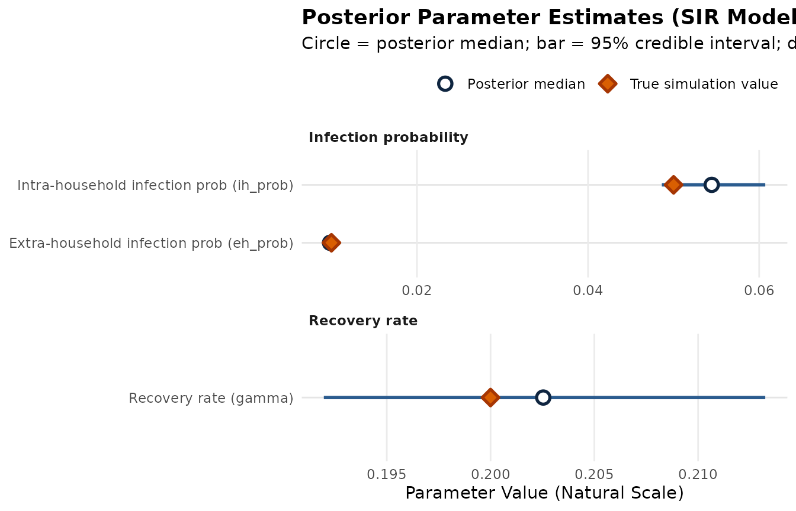
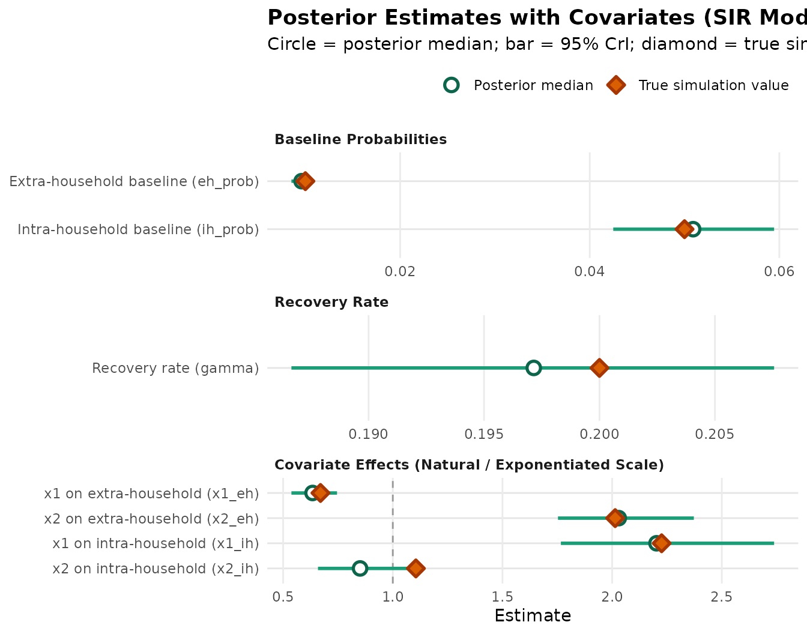

# Basic SIR Model

## SIR model

### Simulate data

We will use data simulated from a basic SIR model for 500 households. We
will assume that all individuals start susceptible. The per day
intra-household infection probability is 5% and the daily
extra-household infection probability is 1%.

``` r

head(sir)
```

    ##   t part_id enroll state hh_size hh_id pcr igg
    ## 1 1       1      1     1       3     1   0   1
    ## 2 1       2      1     1       3     1   0   0
    ## 3 1       3      0     1       3     1   0   0
    ## 4 2       1      1     1       3     1   0   0
    ## 5 2       2      1     1       3     1   0   0
    ## 6 2       3      0     1       3     1   0   0

### Model specification

In addition to the data, the user needs to specify the underlying model
structure, which involves two components:

1.  **The infection process model** which specifies the underlying
    compartmental model structure.

2.  **The observation process model** which specifies the probability of
    observing a positive outcome given an individual is in each
    compartment of the infection process model.

#### Infection process model

The infection process model is built up from a series of user-defined
transitions. There are two types of transitions:
[`transmit()`](https://accidda.github.io/hestia/reference/transmit.md)
defines a transition that occurs as a result of infection (e.g. S\>I)
and
[`progress()`](https://accidda.github.io/hestia/reference/progress.md)
which defines a non-infection transition that occurs at a constant rate
(e.g. I-\>R). For both functions, the user specifies a destination (e.g
`from = S`) and source (e.g `to = I`) compartment. Additionally for
[`progress()`](https://accidda.github.io/hestia/reference/progress.md)
transitions, the user must enter a parameter for the transition rate.
The name of this parameter is at the discretion of the user
(e.g. `gamma` for recovery rate) and can be set to a specific numeric
value of to NA if model should fit that parameter.

``` r

# Basic SIR, fit recovery rate
inf_process <- make_infection_model(transmit(from = "S", to = "I"),
                                    progress(from = "I", to = "R", gamma = NA))
```

#### Observation process model

The observation model is composed of a series of named vectors. Each
vector corresponds to an observation type. Each entry in the vector is
named for the corresponding compartment in the infection process model.
The value is the probability of observing a positive observation given
the individual is in the compartment.

In this example we have two observation types, one which is likely to be
positive when a person is actively infectious (e.g. PCR test results)
and the other which is more likely to be positive when the person is
recovered and immune to infection (e.g. IgG antibody).

``` r

obs_process <- make_observation_model(
  pcr = c("S" = 0.05, "I" = 0.95, "R" = 0.05),
  igg = c("S" = 0.01, "I" = 0.01, "R" = 0.8)
)
```

Now we are ready to run the model!

``` r

# Note this is very computationally intensive so the block is not evaluated
# when knitting

## Inputs
# 1. Infection process model
# 2. Observation process model
# 3. Raw data
# 4. Covariates (optional)
# 5. Starting state probabilities

sir_res <- run_model(
  inf_model = inf_process,
  obs_model = obs_process,
  data = sir,
  init_probs = c(1 - 2 * 1e-10, 1e-10, 1e-10),
  stan_opts = stan_options(iter = 1000)
)
```

Now let’s look at the model results using the `posterior` package.

``` r

# The output from the model in the previous code chunk is available in the
# sir_res package data object

# Get summary statistics. Parameters are returned on the natural (model) scale,
# so no back-transformation is needed.
draws_sum <- summarise_draws(sir_res, "mean", "median", ~ quantile2(.x, probs = c(0.025, 0.975))) |>
  mutate(var_type = c(rep("Infection probability", 2), "Recovery rate"))

# "True" values from underlying simulation
draws_sum$true_value <- c(0.01, 0.05, 0.2)

draws_sum
```

    ## # A tibble: 3 × 7
    ##   variable    mean  median    q2.5  q97.5 var_type              true_value
    ##   <chr>      <dbl>   <dbl>   <dbl>  <dbl> <chr>                      <dbl>
    ## 1 eh_prob  0.00984 0.00984 0.00911 0.0105 Infection probability       0.01
    ## 2 ih_prob  0.0545  0.0545  0.0486  0.0607 Infection probability       0.05
    ## 3 gamma    0.203   0.203   0.192   0.213  Recovery rate               0.2

We can also visualize the parameter estimates alongside the true
simulation values:

``` r

draws_plot <- draws_sum |>
  mutate(
    label = factor(
      c("Extra-household infection prob (eh_prob)",
        "Intra-household infection prob (ih_prob)",
        "Recovery rate (gamma)"),
      levels = c("Extra-household infection prob (eh_prob)",
                 "Intra-household infection prob (ih_prob)",
                 "Recovery rate (gamma)")
    )
  )

ggplot(draws_plot, aes(y = label)) +
  geom_errorbar(aes(xmin = q2.5, xmax = q97.5), width = 0, color = "#2b5c8f", linewidth = 1) +
  geom_point(aes(x = median, fill = "Posterior median"), size = 3, shape = 21, color = "#0f2540", stroke = 1.4) +
  geom_point(aes(x = true_value, fill = "True simulation value"), size = 3, shape = 23, color = "#a63603", stroke = 1.4) +
  facet_wrap(~var_type, scales = "free", ncol = 1) +
  scale_fill_manual(
    name = "",
    values = c("Posterior median" = "#ffffff", "True simulation value" = "#d95f02"),
    guide = guide_legend(override.aes = list(
      shape = c(21, 23),
      color = c("#0f2540", "#a63603"),
      fill = c("#ffffff", "#d95f02")
    ))
  ) +
  labs(
    title = "Posterior Parameter Estimates (SIR Model)",
    subtitle = "Circle = posterior median; bar = 95% credible interval; diamond = true simulation value",
    x = "Parameter Value (Natural Scale)",
    y = NULL
  ) +
  theme_minimal() +
  theme(
    legend.position = "top",
    legend.justification = "right",
    panel.grid.minor = element_blank(),
    panel.grid.major.y = element_line(color = "grey90"),
    plot.title = element_text(face = "bold"),
    strip.text = element_text(face = "bold", hjust = 0)
  )
```



### Add in covariates

We can add covariates on the intra- and extra-household infection risk
by including the optional `ih_cov` and `eh_cov` arguments, respectively,
in
[`run_model()`](https://accidda.github.io/hestia/reference/run_model.md).

``` r

# Simulated data from a basic SIR model for 500 households
head(sir_cov$observations)

# Run model with x1 and x2 as covariates
sir_cov_res <- run_model(
  inf_model = inf_process,
  obs_model = obs_process,
  data = sir_cov$observations,
  ih_cov = sir_cov$covariates,
  eh_cov = sir_cov$covariates,
  init_probs = c(1 - 2 * 1e-10, 1e-10, 1e-10),
  stan_opts = stan_options(iter = 1000)
)
```

Let’s take a look at the results once more.

``` r

# The output from the model in the previous code chunk is available in the
# sir_cov_res package data object

# Get summary statistics. Infection probabilities and rates are returned on the
# natural (model) scale and coefficients on the natural (exponentiated) scale,
# so no back-transformation is needed.
draws_sum <- summarise_draws(sir_cov_res, "mean", "median",
                             ~ quantile2(.x, probs = c(0.025, 0.975))) |>
  mutate(var_type = c(rep("Infection probability", 2), "Recovery rate", rep("Coefficient", 4)))

# "True" values from underlying simulation
draws_sum$true_vals <- c(0.01, 0.05, 0.2, exp(-0.4), exp(0.7), exp(0.8), exp(0.1))

draws_sum
```

    ## # A tibble: 7 × 7
    ##   variable    mean  median    q2.5  q97.5 var_type              true_vals
    ##   <chr>      <dbl>   <dbl>   <dbl>  <dbl> <chr>                     <dbl>
    ## 1 eh_prob  0.00961 0.00960 0.00853 0.0108 Infection probability     0.01 
    ## 2 ih_prob  0.0509  0.0509  0.0425  0.0594 Infection probability     0.05 
    ## 3 gamma    0.197   0.197   0.187   0.208  Recovery rate             0.2  
    ## 4 x1_eh    0.636   0.634   0.538   0.746  Coefficient               0.670
    ## 5 x2_eh    2.03    2.03    1.75    2.37   Coefficient               2.01 
    ## 6 x1_ih    2.22    2.20    1.77    2.74   Coefficient               2.23 
    ## 7 x2_ih    0.857   0.851   0.659   1.10   Coefficient               1.11

We can plot the baseline probabilities, recovery rate, and covariate
effects on the natural (exponentiated) scale:

``` r

draws_cov_plot <- draws_sum |>
  mutate(
    category = factor(
      c("Baseline Probabilities", "Baseline Probabilities", "Recovery Rate",
        rep("Covariate Effects (Natural / Exponentiated Scale)", 4)),
      levels = c("Baseline Probabilities", "Recovery Rate", "Covariate Effects (Natural / Exponentiated Scale)")
    ),
    label = factor(
      c("Extra-household baseline (eh_prob)",
        "Intra-household baseline (ih_prob)",
        "Recovery rate (gamma)",
        "x1 on extra-household (x1_eh)",
        "x2 on extra-household (x2_eh)",
        "x1 on intra-household (x1_ih)",
        "x2 on intra-household (x2_ih)"),
      levels = rev(c("Extra-household baseline (eh_prob)",
                 "Intra-household baseline (ih_prob)",
                 "Recovery rate (gamma)",
                 "x1 on extra-household (x1_eh)",
                 "x2 on extra-household (x2_eh)",
                 "x1 on intra-household (x1_ih)",
                 "x2 on intra-household (x2_ih)"))
    )
  )

ggplot(draws_cov_plot, aes(y = label)) +
  geom_vline(data = filter(draws_cov_plot, grepl("Covariate", category)),
             aes(xintercept = 1), linetype = "dashed", color = "grey60") +
  geom_errorbar(aes(xmin = q2.5, xmax = q97.5), width = 0, color = "#1b9e77", linewidth = 1) +
  geom_point(aes(x = median, fill = "Posterior median"), size = 3, shape = 21, color = "#0d664c", stroke = 1.4) +
  geom_point(aes(x = true_vals, fill = "True simulation value"), size = 3, shape = 23, color = "#a63603", stroke = 1.4) +
  facet_wrap(~category, scales = "free", ncol = 1) +
  scale_fill_manual(
    name = "",
    values = c("Posterior median" = "#ffffff", "True simulation value" = "#d95f02"),
    guide = guide_legend(override.aes = list(
      shape = c(21, 23),
      color = c("#0d664c", "#a63603"),
      fill = c("#ffffff", "#d95f02")
    ))
  ) +
  labs(
    title = "Posterior Estimates with Covariates (SIR Model)",
    subtitle = "Circle = posterior median; bar = 95% CrI; diamond = true simulation value",
    x = "Estimate",
    y = NULL
  ) +
  theme_minimal() +
  theme(
    legend.position = "top",
    legend.justification = "right",
    panel.grid.minor = element_blank(),
    panel.grid.major.y = element_line(color = "grey90"),
    plot.title = element_text(face = "bold"),
    strip.text = element_text(face = "bold", hjust = 0)
  )
```


